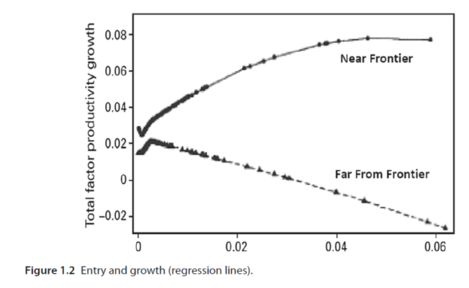

# The Schumpeterian growth model {#SM}

-------------------------------------------------------------------------------------

  By the end of this chapter, you should be able to:

- Describe the toy version of the Schumpeterian model developed by Aghion and Howitt (2005).
- Understand how the model incorporate key features of endogenous growth theories and Schumpeter's insights.
- Understand how the research arbitrage condition works and what is its role.
- Analyse the effect of the of different shocks on the steady state growth rate of technological progress.


-------------------------------------------------------------------------------------

## Introduction

Contrary to the other two factors of production, physical capital and labour, ideas (knowledge) are nonrival. This observation forms the basis of endogenous growth models which describe mechanisms allowing economies to generate a perpetual increase in the stock of knowledge or ideas. One implication of this observation is that the creation of ideas may give rise to positive externalities or knowledge spillovers which allow the economy to escape from diminishing returns and generate long-run growth in labour productivity (or output per worker / hour).

A second implication of the nonrivalry of ideas is that the aggregate production function exhibits increasing returns to scale in capital, labour and the technological stock/knowledge. This in turn means that there cannot be perfect competition in the markets for the two physical inputs, capital and labour. In this case, both capital and labour would be remunerated at their marginal product and there would be no income left to reward the creation of new ideas ($A$), providing no incentives for researchers (entrepreneurs) to innovate. In order to explain technological progress, we therefore need to assume some degree of imperfect competition.

Schumpeterian growth theory incorporates both dimensions into its theory of technological progress. At the heart of Schumpeterian models there is a production process for ideas, i.e. there is a production function for ideas and the production of ideas is the product of the conscious efforts of innovators (researchers or entrepreneurs). This production function for ideas explains the dynamics of the technological stock ($A_{t+1}$) as a function of the labour input into research activities and the current stock of knowledge ($A_t$). In addition, this model builds more explicitly into its mechanics the profit maximisation motive and the role of imperfect competition which is required to generate some rents and incentivise research.

The model presented here is the toy version of the model developed by Aghion and Howitt (1992). This model is not the only one to incorporate the two implications following from the nonrivalry of ideas and discussed above (P. Romer developed an alternative model). Its originality is that it builds on an insight first formulated by the economist J. Schumpeter, who introduced the concept of creative destruction in his book *Capitalism, Socialism and Democracy* (1942). Schumpeter highlighted the key role of entrepreneurs who, in the pursuit of their self-interest, come up with new and better ways of producing goods and services. They are able to capture a larger share of the market because the introduction of these new goods render the previous ones at least in part obsolete, destroying their market share, hence the idea of creative destruction. Entrepreneurs may gain temporary monopoly rents thanks to the existence of intellectual property rights, patents, first-mover advantage or trade secrets. First-mover advantage refers to the fact that once a product is introduced and consumers get used to it, it is difficult to replace it with a new product even if this new product is better. Trade secrets may refer to the amount of resources spent by firms to try and protect the ideas that give them an edge (while their competitors spend some resource trying to uncover them).

This model will allow us to make three points. First, it introduces the idea of creative destruction into the dynamics of the stock of knowledge (or the process of accumulation of ideas), a hypothesis for which there is strong empirical support. Second, it endogenises the share of resources / labour allocated to the research sector, i.e. the model predicts how much R\&D will take place as a function of the parameters of the model, which may be directly affected by government policies. Finally, the model allows for a more detailed analysis of the role of institutions such as intellectual property rights and the structure of the markets such as the degree of competition in the goods market. Institutions in this context ensure that entrepreneurs are incentivised to engage in research activities, a pre-requisite for innovations to occur. In doing so, this strand of research brings to light the complexity of the role of institutions for stimulating growth and reminds us of the context specific nature of the phenomena at play.

## The model

The Greek letters $\alpha$ (“alpha”), $\gamma$ (“gamma”), $\lambda$ (“lambda”) and $\delta$ (“delta”) are used to denote parameters in the Schumpeterian model.

### The productive sector

Each individual lives for one period and chooses their occupation to maximise consumption at the end of the period. The productive sector is composed of two sectors, a final good sector and an intermediate good sector.

The final good sector produces the output good ($Y$) that is eventually consumed using as input an intermediate good $X$. The quality (or efficiency) of the intermediate good is affected by technological innovations $A$ and may increase over time. There are increasing returns to $A$ and $X$ in the production of the final good.

Firms in the intermediate good sector produce the input $X$ using labour $L_X$ and compete with each other by producing goods of better quality $A$ through research activities. The final good sector only uses the input of the highest quality (or frontier quality). Intermediate good firms can be seen as entrepreneurs who have a fixed amount of labour $L$ (we assume no population growth) and decide to allocate their time either to the production of the intermediate good ($L_X$) or to the research activity ($L_A$) which allows them to develop goods of better quality. They therefore face the following resource constraint:

$$
L = L_X + L_A.
$$

Since only labour is employed, the only cost of production is the wage to labour $w$, which is the same for researchers and manufacturing workers.

```{r fig-SG, echo=FALSE, out.width="75%", fig.align="center"}
#, fig.cap="Allocation of labour between production and research"
knitr::include_graphics("images/SG.png")


```


### Knowledge spillovers and constant returns

Through its research activity, a successful entrepreneur creates a new way of producing the same amount of intermediate good $X$ of higher quality at exactly the same cost. More precisely, a successful innovation improves the quality of the intermediate good by a constant factor $\gamma$ (the size of the innovation), ie in each period the quality of the good increase from $A$ to $\gamma A$ ($\gamma >1$), each innovation building on the previous one. Technological progress in this type of models is said to be “quality-improving” as it is improving the quality of the existing good. A successful entrepreneur destroys competition and drives all the other entrepreneurs out of the market. The diagram below shows how the quality of the good is evolving over time in this model via this process of \textbf{creative destruction}.

The stock of technological knowledge accumulates according to the following process:
$A_{t+1}=\gamma A_t \Rightarrow g_A=\frac{A_{t+1}}{A_t}-1=\gamma-1$
In case of success the growth rate of technological knowledge $g_A$ is a function of the size of the innovation ($\gamma$). This parameter is assumed to be fixed but may vary over the long-run.

### The production function of technological progress

The search for the new (or better) goods is a risky and costly venture. The probability of a successful innovation in each period depends positively on the amount of labour time ($L_A$) allocated to research by entrepreneurs and on the quality of the research environment ($\lambda$), which is affected by the level of education of the workforce, the quality of the publicly funded research sector (universities) producing basic research with a high potential for commercial exploitation by entrepreneurs, …. This production function for innovation can be summarised as follows:
$$P(success)=\lambda L_A$$
where $P(success)$ is the probability that an entrepreneur is successful at innovating.
This implies that the expected growth rate of technological knowledge at the level of the economy ($g$) is given by:
$$g=P(success)×g_A=\lambda L_A (\gamma-1)$$
Technological progress depends on the amount of resources devoted to research $L_A$. In order to complete the model we need to explain how these expenditures (allocation) is determined.

### Imperfect competition in the intermediate goods sector

This production function for innovations captures the uncertainty of the research process which depends on luck to some extent but also on the initial investment in research. If the entrepreneur fails to innovate, she makes zero profit and is driven out of the market. Because research is a costly endeavour, the entrepreneur needs to be rewarded in case of success otherwise she would not have an incentive to go into business in the first place. We assume that in case of success, the entrepreneur is rewarded by temporary monopoly benefits for one period thanks to property rights (eg patents). After one period, other firms are able to imitate the new product and the entrepreneur loses its dominant share of the market. Profits in case of success are given by:
$$π_t=PX-w_t L_X$$
where PX is total revenues, P is the price at which the entrepreneur sells the intermediate good and $wL_X$ is the wage bill from producing the intermediate good. For the entrepreneur to make some profit, they need to be able to set the price of the intermediate good, in other words there is some degree of imperfect competition or market power to allow the firm to influence the price (the price is not taken as given).
In order to introduce this idea in a simple way, we are assuming that the closest competitors to the successful entrepreneur can produce an intermediate good of a similar quality but this would require them to use more labour to produce it. More precisely the competitors can produce the same good by using $δ$ units of labour instead of 1 where $δ>1$. This implies that the cost of producing one unit of the intermediate good is $δw_t$ for the competitors whereas is it w_t for the successful entrepreneur. The entrepreneur cannot charge a price higher than $δw_t$ because she would be driven out of the market by the competitors. Therefore the price $P^MAX=δw_t$ is the highest price the successful entrepreneur can charge without losing its market share. A profit-maximising entrepreneur would therefore set the price $P=P^MAX=δw_t$.
Using $L_X=X$ and $P=P^MAX=δw_t$, the profit in case of success becomes:
$$π_t=PX-w_t L_X=δw_t L_X-w_t L_X=(δ-1) w_t L_X$$
The parameter $δ$ controls the share of profits going to the entrepreneur. It may capture various aspects of the product market, such as the strength of the property rights, the degree of market competition, the degree of imitation, barriers to entry, …

### The research arbitrage condition

The **research arbitrage condition** is the key condition that governs the allocation of resources between research activities (which determines technological progress) and the manufacturing sector. It states that for entrepreneurs to invest in research activities, the marginal cost of a unit of research labour must equal their expected marginal benefit:
$$w_t=λγπ_t$$
The marginal cost of employing an additional researcher ($w_t$) should be equal to the expected marginal product of an additional unit of labour employed in research. Each additional unit of labour employed in research raises the probability of success of the research activity (and therefore of receiving the monopoly rents $γπ_t$) by $λ$. 

## Steady state allocation of resources and growth rate

We are now in a position to address the key questions this model is attempting to address: What determines the amount of research effort performed in the private sector? What determines the growth rate of technological progress? What can policymakers do to stimulate growth in the long-run?

All we need to do is to solve the problem of the entrepreneur in the intermediate goods sector, which is to choose the optimal amount of research to perform ($L_A$).
Substituting $π_t$ into the research arbitrage condition:
$$w_t=γλπ_t=γλ(δ-1) w_t L_X$$
Solving for $L_X$:
$$L_X=\frac{1}{λγ(δ-1)}$$ 
Solving for $L_A$:
$$L_A=L-L_X=L-\frac{1}{λγ(δ-1)}$$
Solving for $g$:
$$g_A=λL_A (γ-1)=λ\left[L-\frac{1}{λγ(δ-1)}\right](γ-1)$$

## Discussion and implications for policy

All the insights of the model can be derived from the expression for the rate of technological progress $g$, which states that the rate of technological progress (and therefore of output growth) depends:

- **positively on the efficiency of the innovation process** $λ$. The more likely the research programme is to be successful ($λ↑$), the more researchers the firm employs ($L_At↑$) and the more likely research spending leads to innovations. $λ$ may be influenced by the level of education of the labour force (the higher the quality of the researchers, the more likely they are to succeed), the organisation and funding put into the research sector. These in turn can be affected by government policy.
- **positively on the total labour force** $L$. The higher the labour force ($L↑$), the higher the number of researchers ($L_A↑$) and the more innovations occur. The larger the economy (or the market), the higher the probability of success and the higher the rate of technological progress. To the extent that policy can influence the size of the market (via its openness to trade for example), then this provides another channel through which policy can influence g.
- **positively on the size of the innovation** $γ$. The higher the size of the innovations ($γ↑$), the higher the productivity gains ($A↑$) and the higher the rate of technological progress. Note how $γ$ does not affects monopoly profits $π$ in this model as the productivity gains achieved via the innovations go to the workers via higher wages. The incentives for the firm to engage in research in this model only comes from the fact that they can capture a larger market share for some time.
- **positively on the degree of market power** $δ-1$. The higher the share of the profits in case of success ($δ-1↑$), the more rewarding is the research activity ($π↑$) and the more incentives there are for firms to innovate. Institutions such as intellectual property rights and patents allow for these temporary monopoly rents to exist. They will also determine the length of time innovative firms can benefit from above average profits.

## Extension: competition and technological progress

In an extension of this model, Aghion and Howitt (2005) introduce a distinction between sectors of the economy where the size of the potential innovations $γ^{high}$ are large (for example firms at the technological frontier) and sectors where the size of the potential innovations $γ^{low}$ are relatively low (firms that are lagging behind).

- When ($γ^{high}$), innovations are likely to provide a clear edge to the successful firms, allowing them to capture a larger share of the market; the more competitors in the market, the more incentives there are for firms to capture a larger share of the market by innovating. In this case, more competition would stimulate innovations.
- When ($γ^{low}$), innovations are less likely to provide a clear edge to the successful firms because their new products are still substitutable for the old products; the gains in market share are therefore lower. In this case, the more firms are competing in the market the less likely innovations will lead to large gains in market share and the less incentives firms have to innovate. More competition is detrimental to research effort.

Using UK plant-level data between 1973 and 1994, Aghion et al. (2014) were able to evidence consistent with this hypothesis. The plot below show how lower barriers to entry (the easier it is for new firms to enter a market) may imply different levels of research investment for firms 
Using UK plant-level data between 1973 and 1994, Aghion et al. (2014) were able to evidence consistent with this hypothesis. The plot below show how lower barriers to entry (the easier it is for new firms to enter a market) may imply different levels of research investment for firms depending on how far they are from the technological frontier (how advanced are the technologies they use). These results also highlight that appropriate policies may differ depending on the level of development of the country.

```{r fig-S3, echo=FALSE, out.width="75%", fig.align="center"}
#, fig.cap=""



```
*Source*: Aghion et al. (2014) p 531.


### References {-}


Philippe Aghion (May 2016). “Some”Schumpeterian” thoughts on growth and development”, World Bank Speech. [available at thedocs.worldbank.org]. *A gentle introduction to Schumpeterian growth literature*.

**[Harder]** Aghion, P. and Howitt, P. (2005). “Growth with quality-improving innovations: an integrated framework”, in Ed. P. Aghion and S. Durlauf, Handbook of Economic Growth, Vol. 1A, pp. 67-110. *The “toy version” of the Aghion-Howitt model is presented in pages 69-71*.

**[Hard]** Aghion, P. and Howitt, P. (1992). “A model of growth through creative destruction”, Econometrica, Vol.60 (2), pp.323-351. *This is the original paper*.


